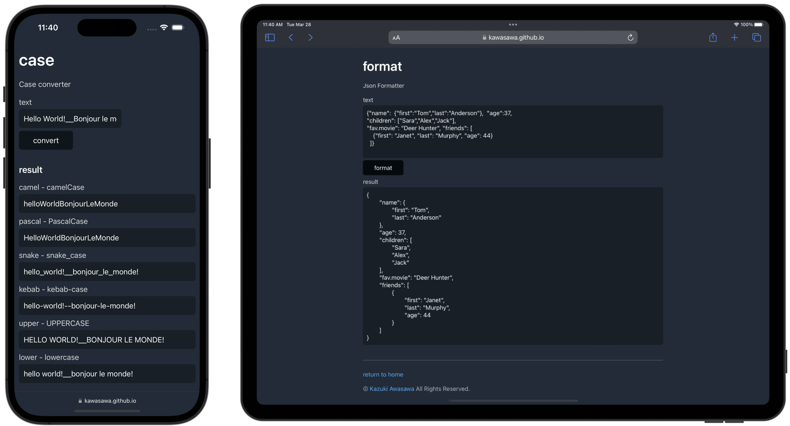
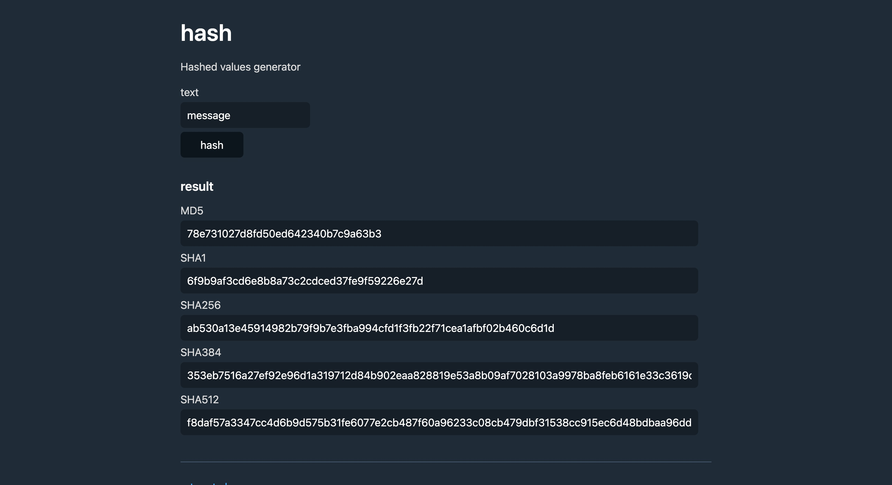

# toolbox

## 概要

開発者向けの簡易ツールです。文字列のケース変換やハッシュ化、Base変換などに対応しています。すべての処理はブラウザ内で行われ、データは外部に送信されません。

## 開発

事前に下記をインストールする。

- Docker Desktop
- VS Code
- VS Code の拡張機能 Dev Containers

下記の手順で開発環境を起動する。

1. Docker Desktop を起動
1. VS Code を起動
1. Reopen in Container を実行

開発環境では下記のコマンドを使用する。

|                                | コマンド      | 概要                                                |
| ------------------------------ | ------------- | --------------------------------------------------- |
| アプリケーションのローカル実行 | `make start`  | アプリケーションをローカル環境で実行する            |
| モジュールの更新               | `make update` | `go get`, `go mod tidy` を実施する                  |
| フォーマットの実施             | `make format` | `gofmt` を実施する                                  |
| 静的解析の実施                 | `make lint`   | `golangci-lint run` を実施する                      |
| 単体テストの実施               | `make test`   | `go test` を実施し `coverage/` に実施結果を生成する |

以上
